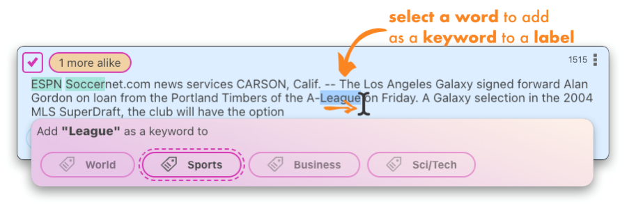

# Label your data

After initial data has been imported, in order to train a model, you need to label them.

Labelator.io offers several tools to allow you label the data very effectively.

## Backlog

The data that needs to be labeled can be accessed through the **backlog**. The number of documents that need to be labeled can be found in the badge located above the menu item. 

For more detailed **statistics**, click on the bar-chart menu button to reveal the **right sidebar**.

## Bulk labeling

You can select multiple documents using checkboxes. The fastest way to select multiple documents is to select a range by extending the selection by holding down the <kbd>Shift</kbd> key while clicking on the last document that you wish to select. The selection will be extended from the last selected document.

You can also add or remove a single document from the selection by holding down the <kbd>Cmd</kbd> / <kbd>Control</kbd> key while clicking on the document. 

:::important
Any changes made to a document within the selection will be **automatically synchronized** with the other **selected documents**.
:::

:::note
You can also extend the selection by holding <kbd>Up</kbd>/<kbd>Down</kbd> while holding <kbd>Shift</kbd>
:::

### Similarity based bulk labeling
One of the major benefits of using Labelator.io is the ability to easily locate and label similar documents while processing a single document. 

The **Autoselect similar** feature, in combination with a customizable similarity threshold, allows for efficient processing of multiple documents with minimal effort.

### Labeling similarity

You can label or vote on the similarity match by clicking the Like or Dislike button on the Similarity Score Badge.

:::note
By providing voting on similarity, you can increase the precision of similarity matching. However, to take advantage of this feature, it is currently necessary to train a new text similarity model and apply it to the project, which will result in reindexing the data.
:::

## Document card
The document layout includes the following elements:

In the top section:
- checkbox to select multiple documents (for bulk actions)
- information badge with the number of similar documents in the database (if in the backlog, only the number of unlabeled documents is shown)
- unique document "key" identifier
- "more options" menu in the top bar, where the document can be deleted

The text of the document in the center 
(with additional metadata potentially shown below)

A label section at the bottom, where a correct label should be assigned to the document.

The label section in the document layout displays all available labels if there are 5 labels. If there are more defined labels, only the most likely labels (if any predictions are made) will be shown. If none of the likely labels are suitable, you can use the "Search for label" autocomplete feature to find the correct label.

## Understanting the labels buttons

Label button can have several visuals, based on configuration and state

 

- **Availible label** - a button representing a label that has not been acitvated (document has not been labeled by it)
- **Likely label** - a label that has been predicted based on heuristic and similar documents beeing labeled. Likely labels are predicted on the fly, no need train/retrain the model, however the precision can be not at good as predicted labels.
- **Predicted label** - a hard prediction of the label made by a trained model.
- **Active label** - document has been annotated with this label
- **Corretly predicted label** - document has been annotated by this label, and model has predicted this label as well

## Keywords

If you have defined a keywords for labels, these will be highlighted with the color assigned to the label. Keywords will be also used for likely label prediction.

In order to assign a keyword to a label when seen during labeling, simply select the word by dragging the cursor over the word, or using doubleblick. A popup will apear that will allow you to assign that word as a keyword. 

