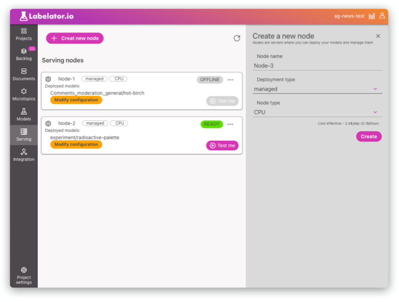
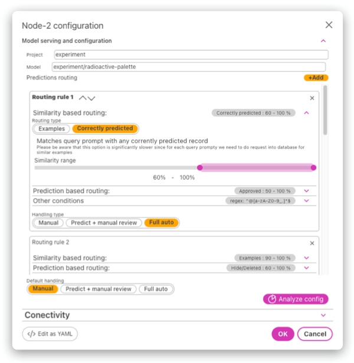
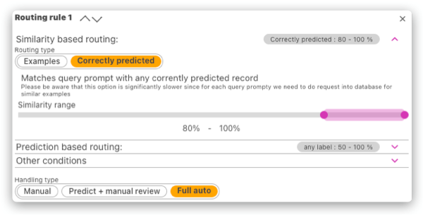
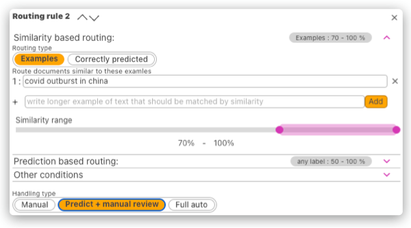
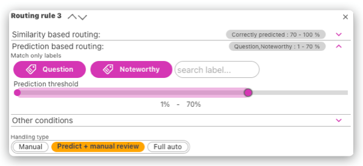
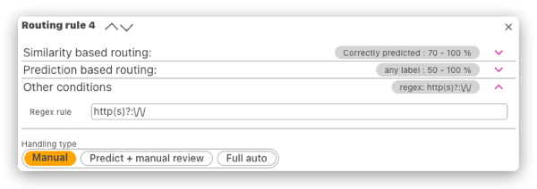
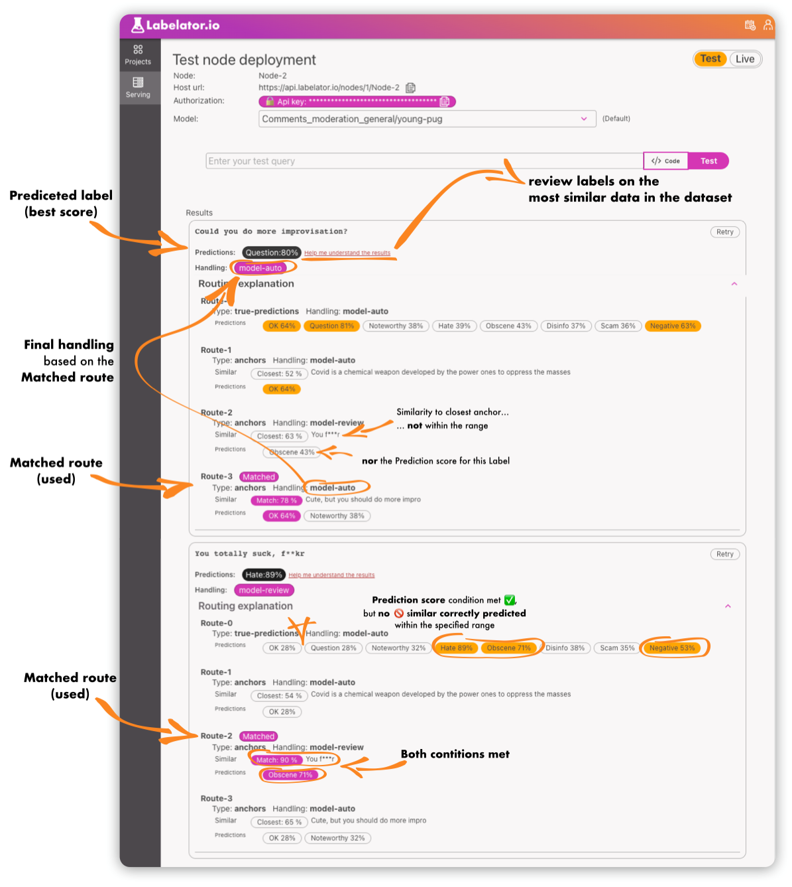

# Serving the model

## Node
To deploy the model, you need to deploy it to a model serving node. A node is basically a virtual machine where you can deploy the model for inference.

You can decide whether to use managed nodes (created by Labelator.io in the cloud) or deploy the node on your own (self-hosted).

If you create a managed node, the VM is created automatically, and all you need to do is define its configuration (and the model that should be deployed here).

For instructions on how to deploy a node in self-hosted mode, please refer to [On-premise deployment](/docs/deployment/custom_node_deployment.md).

## Routing and request handling

One of the big advantages of Labelator.io is its ability to determine the likelihood that the model will provide a correct answer. The problem with models trained on a small amount of data, or data that has been trained on a small subset of possible data, is that new data may not be too similar to the data that the model was trained on.

This is done by an independent model that compares the similarity of the incoming prompt with the training data or provided examples.

### Routing rules
Routing rules can determine the handling type based on:
- **Similarity corretly predicted** (to any of the data in the dataset and calculating the prediction precision within the embedding subspace)

- **Similarity to one or more provided examples**

- **Predicted label and the prediction confidence**

- **Regex match** of the incoming text

:::note
- All of the conditions on a single rule need to be satisfied (the **AND** operator is applied).
- Rules are processed in order. The first rule that satisfies the conditions is used.
:::

This way you can precisely target certain types of data and define how they should be handled:

**Scenario A:**
You find out that the model is not performing well on certain types of data (i.e. for example data within a certain topic). We might not have enough data yet to retrain the model, but we can at least target these kinds of data, and put them in manual mode or prediction with review so we can collect more examples like this and label them correctly and then retrain. We can combine this with a regex rule, so we can target, for example, text with URLs, emails, etc.

**Scenario B:**
We deployed our model, however, the general narrative of the data changed. But the model was trained on old data (imagine a classifier for news headlines pre-COVID and post-COVID). If not properly monitored, we might not even notice that the performance of our prediction dropped significantly. However, we can define a rule that will compare all the incoming data with the data that the model was trained for and the predictions were correct. This way, if a new topic or narrative emerges, we won't have examples of such data in our dataset, and the routing rule will not be matched. Falling down to the default handling mode, which can be manual/predict + review, we will catch these data, allowing us to review the predictions and retrain the model with new narratives.

**Scenario C:**
Wrong predictions for some of the labels can have bad consequences. If this is the case, we can decide to automatically process some predictions but when a risky label has been predicted (perhaps within a lower range of confidence), we want to review all of these data. Gathering more of these examples and retraining the model will also increase the precision and confidence for this type of data.

### Understanding the handling types
Based on the defined routing rules, you can define how the request should be handled. There are three options:
- **Manual**: The model won't provide an answer, which could be interpreted as "I don't know".
- **Predict + manual review**: The model will give you a prediction, but the requested record will be added to the dataset (backlog) for labeling.
- **Full auto**: The model will give you a prediction and the data won't be added to the dataset (since it is likely a prompt similar enough to the data that is already there).

:::info
If **Manual** handling is to be used, it is advised to integrate Labelator.io with your target system via [Webhook callbacks](/integrations/webhooks.md). This way, if an operator labels the data (or corrects the prediction), the [modified webhook](../integrations/webhooks#modified-callback)
:::

<!-- ### Analyzing the routing effects
Setting up the routing can be tricky, especially understanding how many records will be matched by what rules and what effects slight changes can have on how many data will be handled how.

To analyze the effect, we can run an analysis that will provide us with a neat visualization that will help us understand what percentage of the incoming data will be caught by what rule:

Another way to better understand our settings is to test different text prompts in explain mode. After expanding the explanation section, we can see which rules matched the query, which will help us understand the final handling type: -->

## Testing the model and node configuration

Once the model and configuration is deployed, you can test it with our inbuild tool.

When in test mode, the new data are not beeng added into project (as they would, for **Manual** and **Model-review** handling types). 

However we this tool will help us understand the why the model decided the way he did.

As for the decision of the prediction model, you can click the `Help me understand the results` button. This will open a new tab where you can examine the most similar trainning data to our testing query. 

If the prediction was not correct, you might want to review these most similar examples. Ask your self, do we have enough realy similar and labeled examples in the dataset? If no, you can add more, or review the labels for existing ones. 
If yes, it might be that we need to retrain the model.

As for the desicion of the handling type, this tool helps us trace the routing desicion makeing process. The node always take the first route in order that maches all the criteria. The matched criteria for the route are are highlighted.

The route name/number that has been used is also highlighted.

